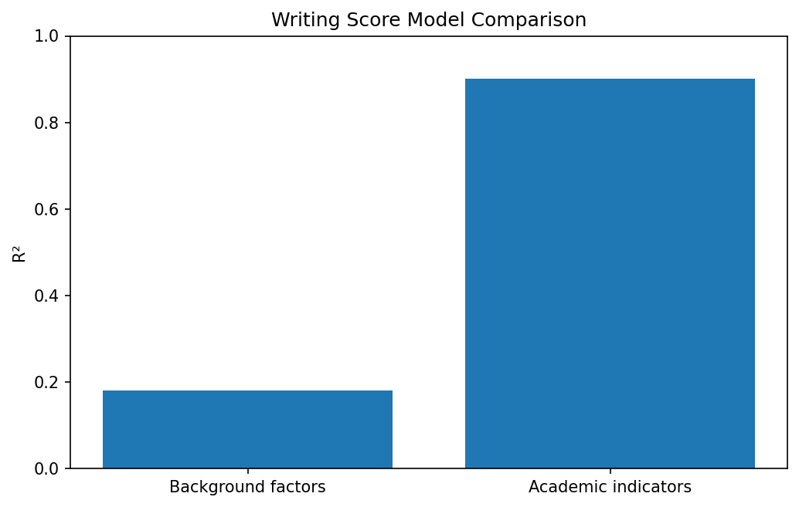
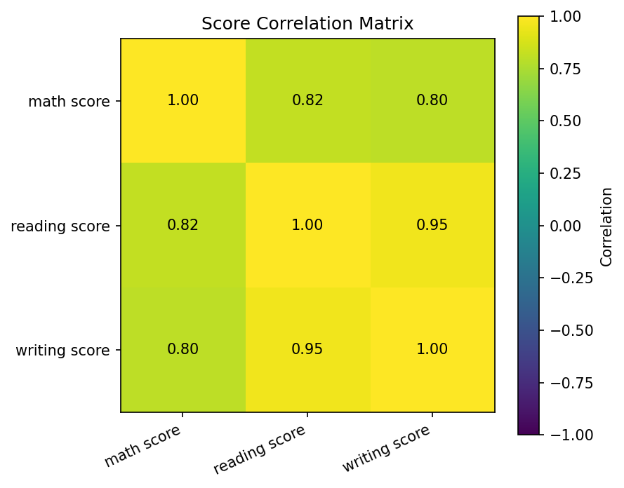
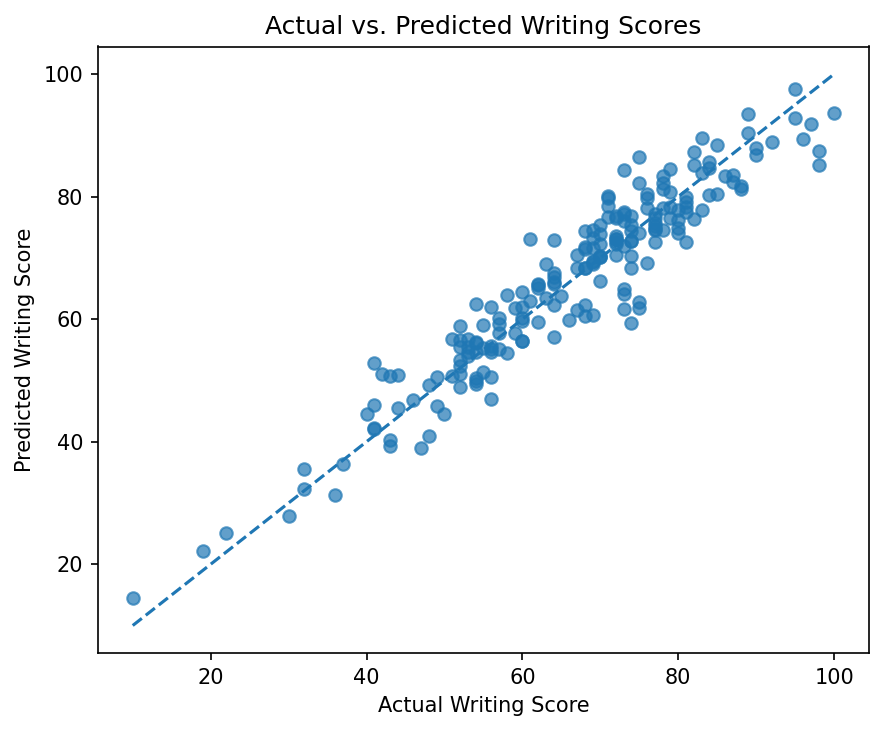

# Student Performance Analysis and Writing Score Prediction

This project explores relationships between selected student background factors and exam performance, then compares two linear regression models for predicting writing scores.

[View the full analysis notebook](student_performance_analysis.ipynb)



## Project Questions

- How do average scores differ across lunch and test-preparation groups?
- How strongly are math, reading, and writing scores correlated?
- How well do selected background factors predict writing scores?
- How much does prediction improve when related academic scores are included?

## Dataset

This project uses the **Students Performance in Exams** dataset published on Kaggle by Jakki Seshapanpu.

- **Source:** [Students Performance in Exams on Kaggle](https://www.kaggle.com/datasets/spscientist/students-performance-in-exams)
- **Records:** 1,000 student records
- **Variables:** Gender, race/ethnicity group, parental education, lunch type, test-preparation status, and math, reading, and writing scores
- **Acknowledgement:** The Kaggle page acknowledges Royce Kimmons' generated exam data tool.

The Kaggle listing labels the license as **Unknown**, so the CSV file is not redistributed in this repository.

To reproduce the analysis, download `StudentsPerformance.csv` from Kaggle and save it at:

```text
data/StudentsPerformance.csv
```

## Analysis Workflow

1. Load and inspect the dataset
2. Compare average scores across lunch and test-preparation groups
3. Examine correlations among math, reading, and writing scores
4. Build a background-factor regression model
5. Evaluate the model using R², RMSE, and MAE
6. Build an improved model using math and reading scores
7. Compare the predictive performance of both models

## Exploratory Analysis

Math, reading, and writing scores are strongly correlated in this dataset.



## Methods

- Exploratory data analysis with pandas and Matplotlib
- One-hot encoding of categorical variables
- Train/test split with a fixed random state
- Linear regression using scikit-learn
- Model evaluation using R², RMSE, and MAE

## Model Results

| Model | Predictors | R² | RMSE | MAE |
|---|---|---:|---:|---:|
| Background factors | Lunch, test preparation, parental education | 0.181 | 14.05 | 10.84 |
| Academic indicators | Math and reading scores | 0.902 | 4.86 | 3.84 |

## Key Findings

- The selected background factors showed limited predictive power for writing scores.
- Math and reading scores produced a substantially stronger writing-score prediction model.
- The stronger result should be interpreted as prediction based on related academic measures, not as a causal relationship.
- Revising the model after evaluating weak initial results was a central part of the analysis process.



## Responsible Use

- This project is for educational and portfolio purposes.
- The models should not be used to make high-stakes educational decisions.
- Gender and race/ethnicity are not used as predictors in either model.
- The academic-indicator model uses scores from related exams taken in the same context, so it is not an early-warning model.

## Repository Structure

```text
student-performance-analysis/
├── README.md
├── student_performance_analysis.ipynb
├── requirements.txt
├── .gitignore
├── data/
│   └── README.md
└── images/
    ├── actual_vs_predicted.png
    ├── model_comparison.png
    └── score_correlation.png
```

## How to Run

1. Clone or download this repository.
2. Download `StudentsPerformance.csv` from the Kaggle dataset page.
3. Save the file as `data/StudentsPerformance.csv`.
4. Install the required packages:

```bash
pip install -r requirements.txt
```

5. Open `student_performance_analysis.ipynb`.
6. Run the notebook from top to bottom.

Running the notebook regenerates the charts stored in the `images` directory.

## Tools

- Python
- pandas
- NumPy
- Matplotlib
- scikit-learn
- Jupyter Notebook

## Limitations

- The dataset does not include variables such as attendance, study time, school resources, or prior-year grades.
- The academic-indicator model uses related exam scores collected in the same context.
- The analysis identifies associations and predictive relationships, not causal effects.
- The findings may not generalize to other schools or student populations.
